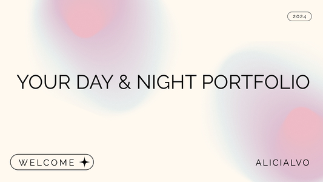

<h1 style="color:#2aa884" align="center" id="title">AL Portfolio</h1>

<p align="center">
  
</p>

<h1 style="color:#2aa884" align="center">Welcome to AL Portfolio!</h1>
<p align="center" id="description">Showcasing my work, skills, and projects using modern web development technologies.<br> This portfolio is designed to provide a comprehensive view of my capabilities and experiences.
<br>Built with a dynamic front-end powered by React, and styled using Material-UI, it represents the best of modern web development.<br> Dive in and explore my projects, skills, and more!


</p>

---

<h2 style="color:#2aa884" align="center">Project Screenshots</h2>

<p align="center">
  
  
 
</p>

---

<h2 style="color:#2aa884">🧐 Features</h2>

Here are some of the project's best features:

* **Responsive Design:** Fully responsive for all device sizes.
* **Theme Switcher:** Toggle between dark and light themes.
* **Dynamic Project Showcase:** Display and filter projects dynamically.
* **Smooth Navigation:** Intuitive and smooth page transitions.
* **Contact Form:** Easy way to get in touch via a contact page.
* **Skill Badges:** Visual representation of skills and proficiencies.

---

<h2 style="color:#2aa884">💻 Built With</h2>

Technologies used in the project:

<h3>Client:</h3>

* Vite
* ReactJs
* Material-UI
* Styled-components

<h2 style="color:#2aa884">Live Action</h2>

* **Online Website:** <a href="https://al-portfolio-1vib.onrender.com/">My Portfolio</a>

---

<h2 style="color:#2aa884">🛠️ Installation Steps</h2>

1. **Clone the repository:**

    ```sh
    git clone https://github.com/ALICIALVO/AL-Portfolio.git
    cd al-portfolio
    ```

2. **Install dependencies:**

    ```sh
    npm install
    ```
---

<h2 style="color:#2aa884">🛡️ License</h2>

This project is licensed under the MIT License.

